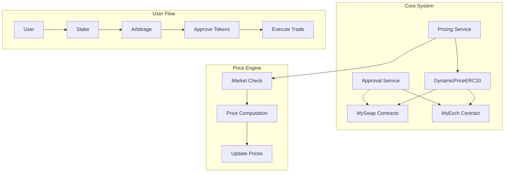

# FlashArb: Reactive Smart Contract Arbitrage Platform

## Overview
A novel arbitrage platform built on Reactive Network that optimizes trading strategies through dynamic pricing and automated approval-based swaps. The system leverages reactive smart contracts to enable efficient token swapping and real-time price monitoring.

## Core Smart Contracts

#### Contract Addresses
(SEPOLIA)
- Staking: 0x1A99F9846551920BDB3768c70FDEfb12E48ed9BD
- EXCH_ADDR: 0x17862a8DeC8833b326C2360c05729e30510cA565
- SWAP_ADDR1: 0x7dE1dC9BCB8404Ff3ad80332C6266a770B1674BD
- SWAP_ADDR2: 0xA9A9b11Ad815818dAcc0fe152E53c38cdf5675EA
- SWAP_ADDR3: 0x008D7dD4925A3A901cD3276192351eaf0Cdf3fa7
- APPROVAL_SRV_ADDR: 0xAaCc8a2D45a6427b9Dd1476f5D18599Fbb3B6Ac3
(REACTIVE KOPLI)
- APPROVAL_RCT_ADDR: 0xd8f0861688c232bc874D983f0c8345cDB20146C6
- STAKING_REACTIVE: 0xaD337E7E8223D5C6BedB2835Eee409dB362dDA8e
### 1. MySwap Contract
The foundation of our platform's swap functionality, implementing approval-based token exchanges.

```solidity
contract MySwap is IApprovalClient {
    ApprovalService private service;
    IERC20 private token0;
    IERC20 private token1;
    
    uint256 public reserve0;
    uint256 public reserve1;
    uint256 private constant PRECISION = 1e18;
    uint256 public currentPrice;
    
    // Key events for tracking swaps and liquidity
    event LiquidityAdded(address indexed provider, uint256 amount0, uint256 amount1);
    event Swap(address indexed user, uint256 amountIn, uint256 amountOut, address tokenIn, address tokenOut);
    event Result(address indexed user, address tokenOut, uint256 amountOut);
```

Key Features:
- Reactive Network approval service integration
- Automated price calculations
- 0.3% swap fee mechanism
- Real-time reserve management
- Liquidity provider functionality

### 2. DynamicPriceERC20 Contract
Implements dynamic token pricing to simulate real market conditions.

```solidity
contract DynamicPriceERC20 is ERC20 {
    uint256 public mintPrice;    
    uint256 public maxSupply;    
    uint256 public mintIncrease; 
    uint256 public burnDecrease; 
    
    event TokensMinted(address indexed to, uint256 amount, uint256 price);
    event TokensBurned(address indexed from, uint256 amount, uint256 price);
    event PriceUpdated(uint256 newPrice);
```

Features:
- Dynamic price adjustment based on supply and demand
- Square root pricing model for realistic market simulation
- Mintable and burnable token mechanics
- Price update events for real-time tracking

### 3. MyExch Contract
Handles token-to-ETH exchanges using the Reactive Network's approval system.

```solidity
contract MyExch is IApprovalClient {
    ApprovalService private service;
    IDynamicPriceERC20 private immutable token;
    
    // Exchange functionality through approval service
    function onApproval(
        address approver,
        address approved_token,
        uint256 amount
    ) external onlyService {
        // Exchange implementation
    }
```

Features:
- Direct token-to-ETH conversion
- Reactive approval service integration
- Dynamic pricing integration
- Automated settlement system

## System Architecture



## Platform Features

### 1. Token Swapping Mechanism
- Approval-based execution
- Real-time price updates
- Automated reserve management
- 0.3% swap fee structure

### 2. Dynamic Pricing System
- Market simulation through supply/demand
- Square root pricing model
- Mint/burn price adjustments
- Real-time price feeds

### 3. Exchange Functionality
- Token-to-ETH conversions
- Approval-based transactions
- Dynamic cost calculations
- Automated settlements

### 4. Price Discovery Engine (`pricingService.js`)
```javascript
class PricingService {
    constructor(swapAddresses) {
        this.swapAddresses = swapAddresses;
        this.updateInterval = 30000; // 30 seconds
    }
    
    async monitorPrices() {
        // Price monitoring implementation
    }
    
    async computeArbitrage() {
        // Arbitrage computation
    }
}
```

## User Flow

1. **Platform Entry**
   - Stake ETH for platform access
   - 5% withdrawal fee structure

2. **Trading Options**
   - Single-chain arbitrage execution
   - Future cross-chain capabilities
   - Direct token-to-ETH exchanges

3. **Trade Execution**
   - Token approval through Reactive Network
   - Automated price checks
   - Optimal route execution

## Development Roadmap

### Phase 1: Current Implementation
- Reactive Network integration
- Dynamic pricing system
- Single-chain arbitrage

### Phase 2: Enhancements
- Cross-chain capabilities
- Dynamic NFT integration
- Advanced pricing models

## Technical Requirements
- Reactive Network compatibility
- Ether.js integration
- Sepolia testnet deployment

## Deployed Contracts (Sepolia Network)
[Contract Addresses To Be Added]

## Security Features
- Reactive Network protocols
- Approval-based execution
- Reserve validation
- Price manipulation protection

## License
MIT License

## Development Team
Prakhar Srivastava


## For Transactions
- [Approval Service](https://sepolia.etherscan.io/address/0xAaCc8a2D45a6427b9Dd1476f5D18599Fbb3B6Ac3#internaltx)

- [Swap1](https://sepolia.etherscan.io/address/0x7dE1dC9BCB8404Ff3ad80332C6266a770B1674BD)

- [Swap2](https://sepolia.etherscan.io/address/0xA9A9b11Ad815818dAcc0fe152E53c38cdf5675EA)

- [Swap3](https://sepolia.etherscan.io/address/0x008D7dD4925A3A901cD3276192351eaf0Cdf3fa7)

- [Staking](https://sepolia.etherscan.io/address/0x87caF149D75435F352bAc6A134afC3a069c3bf94#events)

- [StackingReactive](https://kopli.reactscan.net/rvm/0x49abe186a9b24f73e34ccae3d179299440c352ac)
